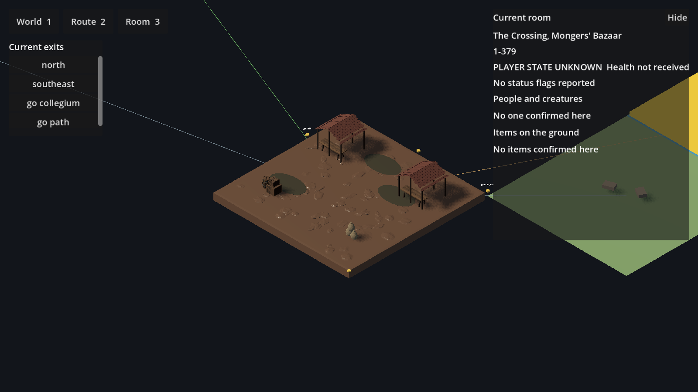
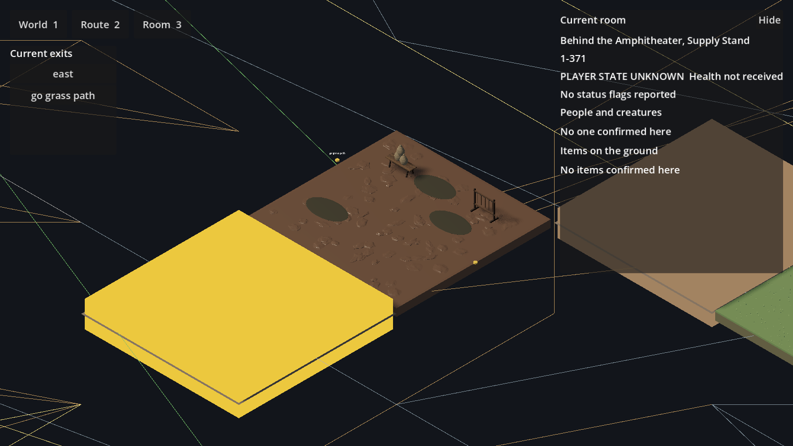
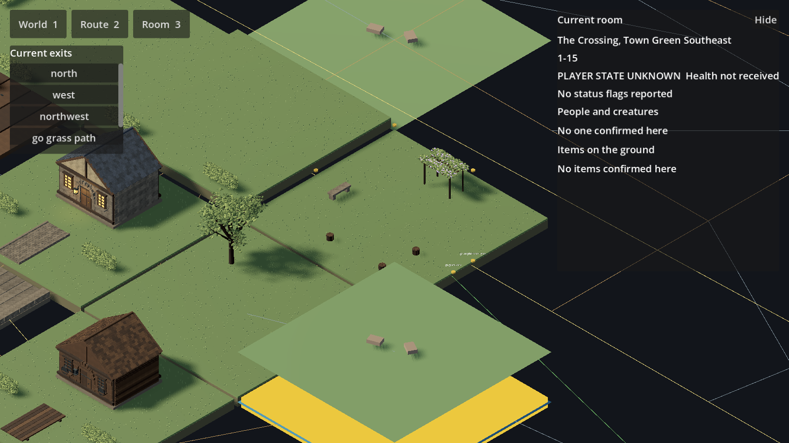
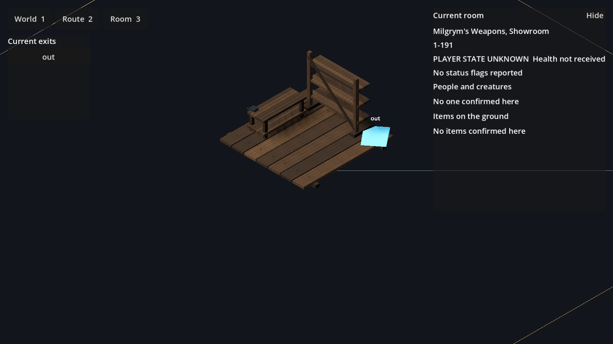
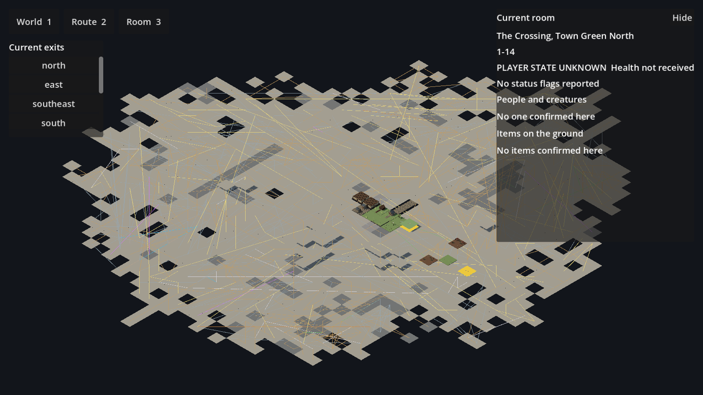
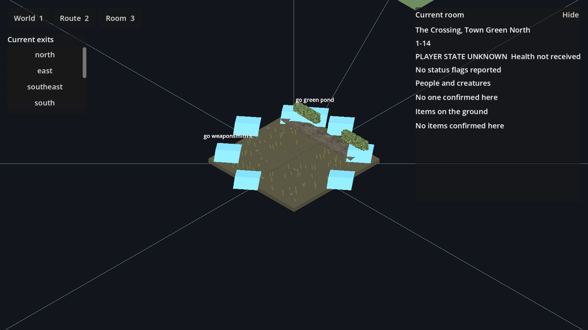
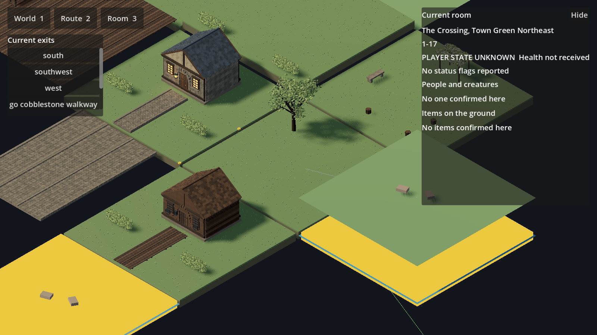

# Crossing native Town Green checkpoint — 6 September 2026

## Scope supersession: all Crossing, one batch

### Batch composition compiler checkpoint

The existing city batch command now compiles actual roomCompositions, not just
an inventory. The current bounded-furnishing-v3 rule set generates 17 partial
compositions while retaining 26 authored overrides. It consumes the existing
source descriptions, authoritative world cells and selected native asset bounds;
the existing SharedAssetContent renderer remains the sole composition renderer.

Every generated furnishing retains its source sentence. The compiler reserves
the central 4m activity space, every declared spawn, and 2m-wide straight exit
approaches. Unlocated exits conservatively reserve all cardinal approaches;
this does not invent door locations. Native AABBs determine placement and
collision clearance. No new models or paid generation services are used.

Only representative-room sources qualify. Seasonal state, negated objects,
remote sound references and unsupported contexts are withheld. This is a small
literal extraction vocabulary, NOT a general semantic parser; complex prose
still needs structured evidence extraction and broader reviewed kit templates.
The 290 evidence/state exclusions are recorded, not silently populated.

Input hashes include description, board, exits, selected asset records and
catalog revision. Unchanged generated recipes are reused. Runtime rejects a
cached generated composition if description, footprint or exits changed.
The capture tool accepts any manifest room ID without per-room source edits.

Actual engine captures inspected: rooms 326, 226 and 227. The first 326 capture
exposed a wrong green outdoor base on an explicitly stone-floored locker room;
the compiler now honors explicit floor evidence and uses neutral unknown ground.
The two Chizili rooms remain partial: jars/vats/table/counter placement is visible,
but herbs, specimen glassware, finishes and connected doorway alignment remain
unfinished. The generated rooms are sparse furnishing passes, not finished
interiors or production-quality city coverage. No 1000x throughput claim is made.

Validation: all 18 Godot scripts passed (4,799 checks); composition compiler
and production cohort tests passed; repeat compilation reused all 17 recipes.
The rendered locker-room base was rechecked after the correction: it is neutral,
not green, but still lacks its intended floor finish and architectural shell.
The legacy missing rock_smallA warning persists in neighboring primitive cells.

Concurrent work discovered on origin/feat/world-content-pipeline at 9491201a
adds all-zone cartographic ground/block classification in world-content-rules.mjs
and build-world-content.mjs. This checkpoint does not duplicate that classifier:
it adds native furnishing composition to the existing renderer. The concurrent
classification work is not integrated or validated here yet. Reconcile its
structural classification and boundary outputs before adding a new structural
classifier; preserve description evidence as the stronger room-specific source.

### Typed architectural exit correction

Whole-word singular matching previously missed doorway, archway, gateway,
doors, backdoor, trapdoor, stairs, stairway and staircase commands. The
canonical tether classifier now recognizes these bounded forms while keeping
portal/ferry precedence and avoiding substring matches such as outdoor.
This changes 120 Crossing edges from other to threshold and 51 from other
to stairs. Commands and target IDs are preserved, including armory 192's
go doorway to 193. Regression tests exercise both classifier inputs and
the generated real Crossing transitions. This is semantic routing evidence,
not proof of physical door or stair placement.

### Internal-room compaction

The canonical packedRoomPositions implementation now has an internal-room
compaction pass after compass repair. It uses reciprocal go/out links,
matching named establishments, same-floor positions and vacant slots.
Rooms incident to compass routes or with exits outside that internal group
stay fixed. Portal, warp, ferry, ladder and stair links do not qualify.
Already one-pitch internal neighbors are preserved. No graph edges are added.

In the current Crossing input this moves 100 eligible room centers closer to
their linked establishment rooms. The 493 compass conflicts are unchanged.
The armory's 192/193/194 cluster is NOT repaired by this pass: surrounding
slots are occupied, so it still requires coordinated cluster placement and
doorway alignment. This is presentation-layout improvement, not evidence of
surveyed geography or finished streets. Tests include unrelated names,
one-way links, portal links, fixed external-facing entrances, deterministic
ordering, full-city non-overlap and retained compass neighbors.

### Bellows-room mechanism

Room 1-194 now selects the shared forge-bellows model at native dimensions
(approximately 2.8 by 4.46m footprint and 2.75m tall). Its air outlet, lever
pivot and operator handle remain named sockets. The compact inferred shell
leaves clearance for the handle and retains the single out command. The
description's nearby forge does not establish an in-room fire position, so
no fire, drummer or workers are statically invented. No animation is added.
The leather folds, nozzle and pivot details remain candidate-quality; room
finish and physical connection to the workroom are still unfinished.
This brings the batch to 24 partial recipes, not completed rooms.

### Tembeg workroom assembly

Room 1-193 now uses its own description hash to admit a compact enclosed
workshop: native anvil, three workbenches, three tool racks, 9m shell and
reversible ceiling/near-wall inspection. Exactly the existing `out` and
`go bellows room` commands receive doorway sockets. This does not establish
cross-room physical alignment or put bellows in the wrong room. The floor
material, wall finish and shell dimensions are explicit presentation inferences.

The shared pack now selects 35 models. Its pin advances to 84847094; the
catalog scene/report are unchanged from a3b714f, and only the existing native
anvil is newly selected. No character models are imported. Dedicated tests
check the two commands, anvil identity, furniture bounds and inspection
restoration. Initial rack/bench intersections were caught and corrected.
The anvil remains too small for the described massive centerpiece, and tools,
repair workpieces, wall/ceiling finish and adjacent bellows-room assembly
remain incomplete. This is the 23rd partial recipe, not a completed room.

### Gameplay-distance surface aliasing

The Trollferry paving/deck diagnostic captures now isolate ambient occlusion,
normal overrides, texture removal, flat unlit shading and anti-aliasing using
the actual viewer. Disabling ambient occlusion and removing textures did not
remove the repeated dotted pattern. Flat unlit shading is only a diagnostic,
not a production proposal. Four-sample MSAA plus FXAA substantially reduces
the pattern with full geometry, textures and shadows retained; these settings
are now enabled in the project. See crossing-native-trollferry-quay-aa.png.
No model simplification or texture-resolution reduction was made. Performance
on lower-end hardware and temporal shimmer still require measurement.

Reproduce the individual room experiments with capture-crossing-content.gd,
room 1-32, and --no-ao, --no-normal, --no-textures, --flat or --aa. Diagnostic
suffixes prevent overwriting normal captures. The --no-normal experiment
was captured before anti-aliasing became the default; use --no-aa with the
individual diagnostic flags to reproduce that baseline. The --no-normal mode
affects mesh material overrides only; --no-textures inspects every active
surface material. These are developer diagnostics, never production presets.

### Whole-city description recovery

Current correction: generic legacy place keys such as Workroom, Workshop,
Salesroom and Lobby joined unrelated establishments. The 3D compiler now
requires matching normalized title families (the establishment before the
comma), retains rejected source IDs and reasons, and excludes rejected prose
from prompts, classifications and runtime asset requirements. This rejects
138 Crossing assignments: **838 compatible bindings, 222 unresolved rooms**.
Subsequent independent research recovered Chizili's Salesroom and Workroom:
the current count is **840 compatible bindings, 220 unresolved rooms**.
Their separate full-title source records replace the unrelated grocery and
armorer descriptions, using short paraphrases of
[the shop's documented rooms](https://elanthipedia.play.net/Chizili%27s_Alchemical_Goods).
No vendor inventory or NPC is instantiated as static scenery.
These counts supersede the earlier 976/84 coverage claim below. Matching title
families remain candidates needing room review, not proof of correct source
prose or current game state. In particular, text mentioning Yalda under a
Forging Society source title still needs independent investigation.

Regression coverage preserves Tembeg and Falken's own descriptions while
rejecting their use for unrelated workrooms, plus Salesroom/Lobby collisions.
No rooms, exits or source descriptions are deleted. The historical archive
report now covers all 220 unresolved rooms: 66 strong historical neighborhood
matches, 130 partial/ambiguous matches and 24 without a title match. No new
art is admitted by this correction. The old 84-room figures below describe
the earlier audit only, not current coverage.

A pinned 2020 DragonRealms XML mapping archive is now audited against every
missing Crossing room, using exact titles, exact plain-string commands, and
destination titles rather than assuming equivalent room numbers. The report
contains IDs, comparisons and description hashes, not copied archive prose.
It never changes current topology or approves assets. Of the remaining 84
missing rooms, 23 have a unique candidate matching all outgoing neighbor titles,
59 are partial/ambiguous and 2 have no exact title match. The archive is
historical and even the strongest match requires review.

Town Green Pond (client room 467) was independently checked against
[Elanthipedia's normal and winter descriptions](https://elanthipedia.play.net/Town_Green_Pond).
A short paraphrased evidence record now describes its silty bank and seasonal
furnishings. Wiki/Lich room 10177 is not the client map ID. This admits source
evidence, not a finished pond model or a permanently spawned gelapod.

Run tools/audit-crossing-archive.ps1 after rebuilding the city batch, then rebuild
the batch again to attach candidate IDs. Source pin and hashes are in
data/world/crossing-archive-candidates.json. All 774 Godot checks, geometric brief
checks, primitive-world checks and archive consistency assertions passed.

### Rejected experiment: globally monotone spacing

A trial used one monotone transform per source axis and a nonoverlap constraint
for every same-floor room pair. Equal coordinates stayed aligned. Although its
headless checks passed, the actual Town Green North render showed large empty
gaps: distant coordinate constraints stretched the local neighborhood. The trial
was rejected and removed, not kept as an alternate renderer or production option.
The preceding lattice layout remains current and incomplete.

The rejected trial's compass mismatch count fell from 842 to 3. Midton Circle 1-264 north to
1-265 and its south return already disagree with the source map coordinates.
The remaining 1-867 north to 1-806 mismatch comes from separating coincident
source nodes into distinct display positions. All three require deliberate
endpoint treatment; no game exit was changed to hide a geometry discrepancy.
The trial's exhaustive rectangle check found every same-floor pair disjoint.

This demonstrated why a passing bearing/overlap test is insufficient for visual
acceptance. The batch ledger now separates source-map discrepancies (2) from
presentation-layout discrepancies (840). Next: local street constraints and
separate interior presentation, without global axis coupling. No model was
added or deleted in this experiment. The full goal remains active.

The user's completion target is now explicitly all 1,060 rooms of Crossing, not
a Town Green neighborhood. [City-wide production authority](../CROSSING_CITY_BATCH.md)
and its full JSON ledger are generated by tools/build-crossing-city-batch.mjs.
Checkpoints below are historical increments, never completion of that target.

The layout compiler now preserves the source map's north/south sign and reserves
the dominant street lattice before placing diagram insets. All 22 compass links
within the six-room Green have exact matching neighboring positions. This is
only a verified local consequence of a shared compiler repair: the full-city
audit still finds hundreds of mismatched compass bearings and is NOT accepted
as a finished city layout. Other diagram regions need topology-aware design.

Production prompts no longer request cute, chunky five-metre blocks. Feature
classification now matches whole words and excludes the figurative 'stream of
customers'; the original source descriptions remain unchanged.

## Current: description-led buildings and larger, compact rooms

### Continuation: native-scale ground and connected approaches

Plank approaches and cobbled streets/plazas now repeat bounded modules to fill
their declared footprint. Each copy retains native height and is never enlarged
horizontally; only a small fit-down distributes an integer number of modules
across the requested envelope. This replaces the rejected room-wide stretched
planks and oversized paving. Mesh resources remain shared, but additional
instances have a rendering cost: dense-scene performance is still unverified.

The armorer and weaponsmith approach endpoints now derive from their fitted
building entrance sockets and run to the room edge. This is visual composition,
not an invented exit or navigation mesh. The straight south-facing approach
contract is deliberately limited to these two authored recipes; arbitrary
curved or rotated path routing is not implemented.

Room framing displays only graph segments incident to that room. World and route
framing restore the full graph, while the exact command list stays unchanged.
This removes unrelated city-wide lines crossing the local scene without removing
topology. Repeated curbs, overly regular board patterns, sparse interiors and
unfinished grass/mud treatment still need art work. No new source models or paid
services were used in this continuation.

Continuation validation: 774 checks across 18 Godot scripts and 27 geometry
drift checks passed. Twelve room captures and the overview were regenerated;
Town Green North was inspected at gameplay framing. The optional legacy shared
submodule warning persists for fallback rocks, not the packaged native catalog.

This section supersedes the counts, dimensions and cyan-marker presentation in
the historical checkpoints below. The Crossing vertical slice remains unfinished.

Seven new complete exterior archetypes are mounted: Tembeg's unpainted armorer
shop (1-225), Milgrym's plain weaponsmith (1-14), the trellised herbalist (1-7),
old stone residences (1-22), Orem's low, long bathhouse on the north side (1-95),
a thatched cruck cottage (1-100), and the long stable with high double doors
(1-112). Mud court and tattered shelter assets bring this batch to nine assets.
The shared catalog now has 89 models; the consumer packages 26 models across
19 explicitly partial room recipes. Native source revision:
`688ecc25c7ba3f0dc34f048fbfa42f71874a1f49`.

Bindings use full stored room descriptions and description hashes, not merely
room titles. Tembeg has exterior sample shields but no sign or paint; the
herbalist has facade trellises. Dimensions, unspecified masonry and roof choices
remain interpretations in each recipe, not claims about canonical architecture.
The stable's outer town wall and species-accurate herbalist plants remain missing.

Room width and depth are four times the previous footprint: 17.6 by 17.6 metres,
sixteen times the area. Adjacent presentation slots are 18 metres apart, leaving
only a 0.4-metre block seam. Non-terrain models are capped at native scale so
the extra area is space for room composition and occupants, not giant furniture.
This establishes capacity, not completed battle layouts for every room.

Offline and live compilers share deterministic compact slot packing. Original
source coordinates remain in the offline manifest; packing preserves all 1,060
room identities and 2,389 directed routes without inferring adjacency as an exit.
This is presentation layout, not surveyed geography: collision resolution can
displace compass bearings, and adding rooms can move later slots. Compass command
studs are not proof that a destination is geometrically in that direction. Door
socket-to-command binding and stronger topology-aware placement remain follow-up
work. Small gold studs replace the rejected cyan diamonds; exact legal commands
remain available through the exit list.

Validation: 459 checks across 18 Godot scripts, 27 geometry drift checks,
primitive-world and presentation bridge checks, and the TypeScript/Vite build
passed. Building tests measure mesh bounds, entrance-facing and closed-shell
metadata. The shared build passed all 89 GLB/native bounds roundtrips; the first
batch preserved all 80 prior GLB hashes, and the 94-instance assembly reloaded.
Twelve room captures plus an overview were regenerated in the real viewer.
North, armory approach and bazaar were inspected after compact packing; earlier
building reviews also covered herbalist, bathhouse, residences and cottage.

The first straw roof was rejected and rebuilt with overlapping bundles; pale
mud clods were rejected and replaced with flattened brown irregular clods.
Remaining visible problems include stretched ground textures/planks, overly
rigid shelter cloth, fine shadow stippling, route-line clutter, sparse room
dressing, fallback blocks, and unfinished interior shells. New building variety
does not mean all Crossing rooms are authored. Dense-scene performance and live
multi-character battle/traversal acceptance are not established by these checks.

## Historical checkpoints

## Shadow-striping correction

The broad diagonal bands recorded in the preceding captures were primarily
shadow self-interference, not authored mud detail or an extra room base layered
over the composition. The room factory replaces the fallback geometry; source
dirt does contain two wheel tracks, which remain visible after correction.
Changing lighting alone removed the broad bands in actual viewer captures.

The previous 0.03 depth / 0.15 normal bias came from a differently configured
catalog review stage. A first trial used 0.1 / 2.0; the retained setup uses
0.1 / 1.0 with an explicit 4096 directional shadow atlas. Cast shadows and
ambient occlusion remain enabled; no meshes or texture detail were removed.
Godot documents the self-shadowing versus shadow-offset tradeoff in
[Light3D shadow bias](https://docs.godotengine.org/en/stable/classes/class_light3d.html#class-light3d-property-shadow-bias).

All seven room captures plus the overview were regenerated in Forward+ on
Godot 4.7.2 / RTX 4070. Bazaar and bower were visually inspected: broad banding
is removed and canopy shade remains, but fine shadow stippling still needs
tuning. This is not a pixel-perfect or lower-GPU performance acceptance.
Increasing atlas resolution adds GPU memory cost. The existing optional legacy
submodule fallback warning remains unrelated and unresolved.

403 checks across 18 Godot scripts pass. Three checks guard the retained shadow
configuration, not pixel quality; visual inspection remains necessary. No new
models, muddy terrain asset, service credits, or topology changes in this pass.
Earlier sections' striped-ground observations describe their historical capture
state; current image paths now show the corrected lighting.

## Bazaar furnishing continuation

Mongers' Bazaar now has two canvas shelters with tables beneath them and two
separate storage groups, replacing the single shelter and disconnected table.
Seven pieces reuse five already-packaged models with no new binary asset payload
or service credits. This is a partial interpretation of the existing hashed
room description, not a change to room topology, shop inventory or population.

The central 20 percent of room width is reserved as an unobstructed visual aisle.
Tests measure full mesh bounds, including canopy overhangs, rather than trusting
placement points. The first layout failed this check and was revised. Additional
checks ensure both tables fit inside their shelter footprints. All 400 checks
across 18 Godot scripts pass. The actual viewer capture was inspected: arrangement
is coherent, but matching shelters are too pristine for the described tattered
market, ground remains striped rather than muddy, and debug exit markers dominate.
Those defects keep the recipe `partial-authored`; this is not final art approval
or complete Crossing delivery. No live traversal or occlusion acceptance performed.



## Support-socket placement continuation

Supply Stand supplies now sit on the trestle table's published `surface` socket,
not an independently guessed 0.42 m lift. The existing composition factory
transforms that source-local socket through the support's fitted scale and yaw.
This reuses the existing catalog metadata; no new assets, paid generation,
navigation rules, or parallel assembly system were introduced.

Optional piece field: `support: { "pieceIndex": 1, "socket": "surface" }`.
The index identifies an earlier piece in the same recipe; the socket replaces
the supported piece's center, and `lift` is world-space vertical clearance.
The supported piece keeps its independently declared envelope and yaw. Missing
sockets, self references, and forward references refuse the whole composition
and use the existing fallback. This is placement, not a collision or physics
solver; authors must still review support width, load silhouette, and overlap.

Validation: 18 Godot scripts / 389 checks passed; 27 board geometry checks passed.
Regression tests vary table scale and rotate it, measure actual mesh bounds,
and verify support contact and refusal behavior. Seven room captures and the
world overview were regenerated through the actual viewer. The new capture
shows correct table contact but also unresolved striped ground, prominent debug
markers, neighboring fallback blocks, and disconnected room platforms. It is
**not** accepted as finished district art. The optional legacy shared submodule
is unavailable in this checkout; its fallback warning remains visible, while
the packaged native furniture loads successfully. No live-character run occurred.



## Current expansion checkpoint

This section supersedes the six-room / mock-only scope below, which is retained
as the first checkpoint's history. **The requested complete vertical slice is
still unfinished.** Loading all rooms is not the same as finishing their art.

- The authoring viewer now loads the entire compiled Crossing graph: **1,060
  rooms and 2,389 directed local transitions**. The 19-room fixture remains for
  focused regression tests. World framing now fits the full graph's extents.
- **14 partial room compositions / 17 packaged native models**: the six Green
  rooms plus Via Iltesh (two cells), S'zella Plaza, Supply Stand, Back Lawn,
  Mongers' Bazaar, Milgrym's showroom, and Tembeg's salesroom.
- The shared catalog now contains **80 models**. New reusable assets are
  continuous turf, cut-log seating, a nailed plank approach, and display shelving.
  The first lawn's checkerboard treatment was rejected and replaced. All prior
  76 portable model hashes remain unchanged.
- Source revision: `8ef2a7d2fcf4b9485bc1f63c6e3fd030e83b8d96`.
  The packager now refuses a checkout at a different revision. The subset is
  approximately 26.4 MB. Geometry is not decimated.
- The live manifest loader now enriches a cell using world ID, exact cell ID,
  and complete title. A conflicting supplied description hash refuses enrichment.
  Only content fields are copied: live positions, board dimensions, exits and
  population remain untouched. Metadata explicitly says the description is a
  **compiled reference, not a newly confirmed live description**.
- This binding is exercised with live-shaped snapshots and the actual content
  factory in tests. No live-character session or full command-to-room-change
  acceptance run was performed. Different Lich ID namespaces do not get guessed
  matches; a mapping audit remains required for such sessions.
- Corrected two source collisions in the existing place map. Milgrym no longer
  receives Berolt's description, and Tembeg no longer receives a food-shop
  description. Paraphrased room-specific visual evidence is linked to
  [Milgrym's Weapons](https://elanthipedia.play.net/Milgrym%27s_Weapons) and
  [Tembeg's Armory](https://elanthipedia.play.net/Tembeg%27s_Armory).
- **381 Godot checks across 18 scripts pass**. Geometry-drift gate: 27 checks
  pass. Fixture contract, geometric briefs and primitive-world tests were rerun.
  The first PR's red gate was repaired; no unrelated tests were suppressed.

### Current visible results








The market is still a furnishing study, not a finished crowded market. Shop
fixtures still lack their inventory and finished enclosing architecture. The
weaponsmith's pine bench remains missing; a stone substitute seen in the first
review was removed rather than admitted as an inaccurate literal asset. Do not admit these sets
as lore-complete production scenes.

### Remaining work toward the complete vertical slice

1. Resolve district-scale composition and adjacent exterior/interior boundaries
   through the existing board compiler. The current small separated tiles are
   still visibly unlike the accepted coherent-town reference.
2. Author the remaining rooms and named landmarks. Every composition's missing
   pieces are machine-readable in the selection ledger; none is marked complete.
   This pass does not claim the other 1,046 rooms are finished.
3. Audit source identity across the city. The current catalog reports 85 rooms
   without a description; another 138 described bindings have a different full
   source title. Some may be valid place-level reuse, but cannot be treated as
   room-specific proof without review. The corrected shops demonstrate the risk.
4. Complete waterfronts, streets, civic buildings, interiors, inventory displays,
   species-specific plants, and reusable character models; retain full exterior
   geometry, not permanently half-open demonstration houses.
5. Verify dense-scene performance, exact door-facing/approach placement,
   marker and label clearance, keyboard/mouse traversal, live reconnect and
   confirmed movement with a real character. Animation remains deferred.

## Historical first checkpoint

Publication integration: the branch retained automation commit `f04ceab6` (the
coverage count reflects the two corrected shop bindings) and current main
`129e222b` (AI suggestion confirmation). Neither overlapped the scenery changes;
both histories were merged, not rewritten. After integration, the 381 Godot
checks and frontend build passed again; imported AI-suggestion and worker checks
passed with 150 and 125 checks respectively. The separate character-workshop
edits in the shared checkout were not staged or modified by this work.

This is **six partial room compositions in the actual Godot viewer**, not a finished
Crossing city, a live-game acceptance run, or the generic river-port demo renamed.
No paid generation or service credits were used.

## Delivered

| Exact room | Composition | Still missing |
| --- | --- | --- |
| 1-14 Town Green North | grass, narrow cobbles, hedges, approach strip | Milgrym exterior; specific privet; convincing bent-grass surface |
| 1-15 Town Green Southeast | vine bower, stone bench, open center | modwyn fruit; stump stools; limestone-specific material |
| 1-17 Town Green Northeast | grass and oak | ancient-tree-specific treatment |
| 1-23 Town Green Southwest | dense west/south hedges | lunat trees and species-specific thorns |
| 1-16 Town Green South | grass and divided hedge boundary | lunat trees |
| 1-225 Town Green Northwest | hedges and entrance gap | plank approach and unpainted Tembeg exterior with displayed work |

Positions within these small tiles are composition choices, **not surveyed MUD
geometry**. Species-specific omissions are explicit rather than claimed complete.
The source description for North uses “stream of customers”: the old broad
classifier selected water. This exact composition suppresses that generic water
primitive without claiming the classifier is now fixed for other rooms.
Remote civic buildings mentioned in South are not placed in that room.
The unresolved pond receives no inferred composition.

## One runtime path

`WorldRoot._mount_cell_detail → ContentRegistry.build_cell →
SharedAssetContent.build_room_composition`.
The content factory requires the exact cell ID and source description hash from
`godot/assets/shared_asset_selections.json`. A mismatch returns to the existing
primitive registry. No map positions, exits, commands, entity state, selection
bounds, camera heading, or population are fabricated or modified.
The existing two-hop detail window mounts and unloads compositions normally.
**Currently exercised in the compiled mock fixture, not live gameplay:** the live
snapshot compiler does not yet carry description hashes or authored scene bindings.
These compositions therefore correctly refuse live cells without the hash. Wiring
compiled content to confirmed live topology is still required; this pass does not
weaken the exact-description check to conceal that missing connection.

The same selection file holds both the seven source asset IDs and room recipes.
There is no second renderer or alternative topology. Native model templates are
cached once; instances share mesh/material resources. Full polygon geometry is
retained, with explicit miniature fitting to each published footprint. Horizontal
ground-strip fitting is nonuniform; props retain uniform proportions.
The packaged subset is roughly 17 MB; it is not a measured runtime performance budget.

Source: shared-game-environment-library revision
`63ccd5d1b5d61364ab789ed8c0f19631ee5cd7cd`.
`godot/assets/crossing/provenance.json` records exact model bounds, source/native
hashes, material sources and CC0 texture licenses. Native textures are preserved;
this does not use the flatter portable geometry-only GLB exports.

## Evidence

The capture script opens the actual WorldRoot and uses its mock bridge to focus
three confirmed fixture rooms. It narrows orthographic size to 12 for inspection;
the default room camera remains unchanged. It does not fabricate occupants.






Visual inspection found and corrected ground strips shrinking to small squares
under uniform fitting. A shared ambient/AO environment now lights the actual
viewer; this is not screenshot-only lighting.

## Verification and remaining gates

- Godot 4.7.2: 17 test scripts, 310 checks passed at the first composition checkpoint.
- Dedicated content checks: all declared pieces, full mesh XZ bounds inside the
  published footprint, changed-description refusal, wrong-room refusal, unresolved
  pond refusal, and no mutation of the source graph.
- Regenerated fixture contract: 61 checks passed; its one non-applicable committed
  live-snapshot drift check was explicitly not checked. Kit and primitive-registry
  checks passed. Dependencies were installed after the initial Node check reported
  the missing Tauri API package; the rerun passed.
- Real viewer captures: NVIDIA RTX 4070, Forward+, three room views inspected.
- Existing foundation GLB submodule is absent locally. Unauthored rooms therefore
  show the established explicit fallback warning; the bundled native subset loads.
- No live character, dense population/performance benchmark, complete city build,
  final lore approval, or installer verification is claimed.

**The main visual gap remains substantial:** the viewer's small, separated board
cells do not yet produce the coherent, richly dressed town requested by the user.
The current marker size and some non-compass labels compete with the small scenery.
Coarse turf is not yet a convincing manicured lawn, and the catalog's decorative
bower is not an exact modwyn botanical asset. Do not present these captures as the
accepted river-port quality target achieved in the client.

Next build work belongs in the existing board/recipe system: reconcile published
footprints with district-scale composition and exact route/door anchors, build the
named exteriors from room-specific evidence, and complete the listed vegetation
and seating. Do not scatter generic buildings over unresolved descriptions or
silently enlarge scenery beyond known bounds.

## Reproduce

### Paving repetition correction and lighting probe

The shared `cobble-street` source contains raised curbs on both sides of each
4 m module. Repeating it across a full room created interior parallel curb
lines, not merely a texture artifact. Broad bases in rooms `1-12`, `1-13`,
`1-25` and `1-26` now use the already-selected curb-free `cobble-plaza` module.
Small authored curbed approaches remain separate. A regression check prevents
curbed street tiles from returning as full-room base recipes.

The quay/approach view was rendered and inspected with the normal lighting.
Its repeated raised lines are gone. A separate `--unshadowed` capture disables
only the sun's cast shadows and writes an `-unshadowed` diagnostic image, never
overwriting the normal render. Fine surface stippling persisted in that probe;
this does not establish its cause, and material/SSAO review remains open.
Production cast shadows were not disabled or weakened. The diagnostic image
is not a proposed visual direction. All 4,377 Godot checks passed.

### Trollferry bank and street continuation

Rooms `1-25` and `1-26` now continue into `1-32` as one description-led approach
sequence. Their shared place description is not repeated as a separate pier
in each room. Both approach rooms receive fitted street ground; four measured
retaining-wall sections form the river-facing edge of `1-26`, leaving a 3 m
opening for the 2.9 m pier approach. East/west room centers follow the actual
graph and their standing surfaces have equal world height. The standard room
gutter remains; no additional movement commands are created.

Stone retaining construction and cobbled paving are explicitly inferred art
choices, not claims that the description specifies those materials. Bank wear,
the north and east continuations, and society building frontage/threshold are
still missing. The native selection now contains 34 models; the city inventory
contains 22 partial recipes and zero approved-complete rooms.

The reusable `alignTop` placement flag derives cap/board elevation from the
fitted native bounds rather than a copied asset height. It is used by the new
bank caps and the quay's plank approaches. Tests verify caps meet street
height, the bank opening is clear, and the connected room surfaces agree.
The 18-script Godot suite passed 4,355 checks for this checkpoint.
The updated quay view was rendered and inspected. The bank now joins the pier
approach at the intended opening, but the broad street surfaces look repetitive
and under-dressed. Their material treatment needs refinement before visual
approval; the neighboring south waterfront also remains an unbuilt placeholder.

### Trollferry Quay composition checkpoint

Room `1-32` now uses its description-hash-bound pier and dinghy composition.
The packaged selection contains 33 models, including the shared clinker boat
and pier section. Three dinghies sit in steel-grey water, with four native pier
sections and two fitted plank approaches. East and south approaches reach the
published room edges; the real `go rotting ruin` command remains present but
its architectural threshold is not yet built. No working ferry, troll actor
or animation was invented from the historical passage in the description.

Authored surface pieces call the existing registered water/ground factory;
there is no separate water renderer. The city batch now distinguishes surface
kinds from model IDs. Unknown surface kinds refuse the whole composition.
Water is 0.9 m below the published standing surface; boat hulls are immersed
0.18 m, an authored waterline interpretation rather than a simulation. Native
pier deck sockets and plank envelope tops are checked against standing height.
The boats, pier and walkways all remain within the room footprint.

The actual room capture was inspected. The pier joins and boat waterlines read
coherently, but it is too clean for the described ruin, the water is flat, and
neighboring bank rooms still show placeholders. Broken boards, hull wear,
mooring ropes, shore transitions and ruin entrance are recorded as remaining
work. The city inventory is now 20 partial recipes, zero complete rooms. This
is not a completed waterfront or full-city slice.

### City-wide overview occupancy

Every loaded room now retains one base-only overview representation through
the existing ContentRegistry factory path. Detailed room mounting hides it;
unmounting detail restores it. No additional landmarks, buildings, items,
characters, exits or navigation are synthesized. The source board footprint
remains authoritative. Missing-description cells use a darker neutral color;
other unbuilt overview surfaces are neutral too, not a claim that every outdoor
room is grass. An initial green/brown overview was rejected as misleading and
replaced by this abstract treatment.

This closes the visibility hole where most of the city became route lines
over empty space. It does not close any room's art-completion gate: the full
city still needs deliberate geography, streets, architecture and furnishings.
The overview carries `base-only; not completed room art` metadata. The existing
full-city content test checks all 1,060 overview holders, exactly one declared
base each and explicit incomplete status. Detailed geometry remains limited
to the actual-exit neighborhood; no whole-city prop instantiation is added.
Use `capture-crossing-content.gd -- world` for an overview-only capture instead
of replaying the room collection. The older optional shared-rock warning remains.

### Full-city local compass repair

The shared offline/live layout compiler now uses actual compass exits after
its deterministic source-coordinate seed. Up to four passes inspect vacant
slots within three pitches of a room. A move must preserve every currently
correct same-floor compass bearing and every exact one-pitch neighbour; it
then reduces the incident conflict count, or reduces squared displacement
from the desired neighbour positions at the same conflict count. Occupied
slots, floor changes, speculative links and room-title inference are excluded.

City-wide compass conflicts decreased from 842 to 493. The regression test
measures same-floor constraints separately: 841 to 492, with zero correct or
exact neighbour regressions. The extra cross-floor conflict is outside this
local repair policy. All 1,060 rooms and 2,389 directed exits remain present;
all room positions remain distinct, and the closest same-floor centers are
18 m apart. Town Green's 22 checked exact neighbour relationships are retained.
Reversing all input rooms produces identical output. Three full-city timing
runs on this machine took 35, 30 and 26 ms; this is not a browser frame-budget
guarantee. The frontend build, presentation bridge suite and 1,062 Godot checks
passed. Remaining 493 conflicts require larger connected-district layout work;
this local repair is not the final street arrangement or completed city.
Thirteen configured room captures and the overview were regenerated. Town
Green North and the overview were inspected: the compact green remains intact,
but the world view is still predominantly crossing route lines with only the
local detail window populated. This is explicitly not an acceptable finished
city view; distant scene representation and remaining district layouts are open.

### Enclosed interior inspection checkpoint

The two showroom recipes now assemble twenty native wall sections around a
15 m square interior plus a ceiling cover. The native selection contains 31
models. This is a reusable composition mechanism, not a finished building
facade: wall finishes, ceiling treatment and merchandising remain unfinished.
The current ceiling uses the existing repeated plank module and needs a
purpose-built finish. Dimensions and south/east door positions are deliberate
presentation choices, not surveyed DragonRealms architecture.

All four walls and the ceiling exist. Room inspection hides the authored
camera-facing wall sections and ceiling; other rooms and world/route modes
restore the covers. The geometry is retained, not destroyed or permanently
cut away. The policy currently assumes the fixed 45-degree camera and must be
revisited before permitting camera orbit. Tests verify hidden/retained pieces,
restoration and unchanged child counts.

Exact source exit commands are bound to measured entrance sockets. WorldRoot
passes marker-only copies of the current room data to the existing exit layer;
it does not mutate the authoritative graph. Unknown, removed or duplicate
doorway bindings refuse the composition. These local socket bindings do not
solve the remaining district-scale tether geometry or the 842 compass-layout
conflicts. Both focused room views were rendered again; the rear walls now
bound the furnishings, while the floor repetition remains visually weak.

### Shop furnishing integration checkpoint

Shared environment revision `60ce6b4eea2585fd6c707db730d9880471940b75`
provides 29 selected native models. Milgrym showroom now separates a table,
counter, bench, rack and bin as its source description requires. Tembeg
salesroom uses a counter and open display bin instead of a workshop bench and
freight stack. The pine-specific finish, actual displayed inventory, baskets,
leather-goods box, armored figure and interior shells remain explicit omissions.
No static character or item population was invented. The rejected checkerboard
picnic table is not selected for runtime use.

804 checks across all 18 Godot scripts passed, including non-overlapping shop
furniture envelopes and a clear central player area/south approach. This does
not prove all entity spawn slots or source door bindings are solved. Actual
weaponsmith and armory-interior captures were inspected: furnishings fit, but
the large exposed floors are visually sparse and do not yet read as enclosed
shops. The floor plank repetition is also conspicuous at this distance. These
are partial compositions, not completed or visually approved rooms.

Focused capture now accepts room IDs after `--`, for example
`-- 1-191 1-192`; no arguments still capture all configured views and overview.
The older optional shared-rock import warning remains; these native shop assets
load from the separately pinned, packaged catalog.

From the repository root, using a Godot 4.3+ executable:

```text
godot --headless --path godot --script ../tools/package-crossing-content.gd -- <shared-catalog-checkout>
godot --headless --path godot --script res://tests/crossing_content_test.gd
godot --path godot --script ../tools/capture-crossing-content.gd
```

Set GODOT4 to the executable and run `node tools/godot-tests.mjs` for the full
viewer suite. Tested here on 4.7.2; a 4.3 compatibility run remains separate.
