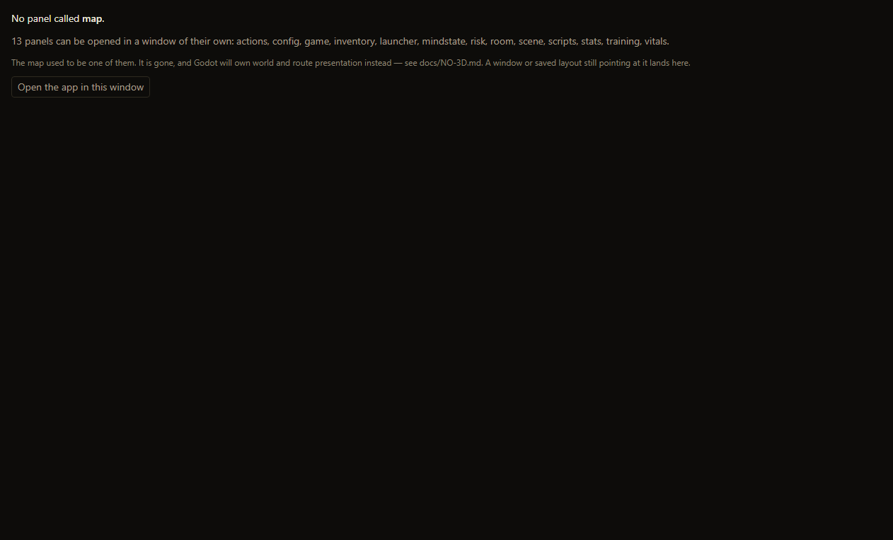

# The map is gone — 9 September 2026

`docs/NO-3D.md`, the same morning: *"The map is gone. It is not coming back,
and cancelling 3D did not revive it. The room-graph data is retained for one
reason: so Godot can consume it and own world and route presentation there."*

That was the decision. The code had not caught up: `?view=map` still had a
branch in `App.tsx`, `map` was still the first `PanelId`, and `PANEL_CONTENT`
still rendered `MapPanel`. This is the record of the run that removed the
presentation and kept the data, and of what it could not say.

## What runs

```bash
node tools/plan-audit.mjs                              # plan ok
npx tsc -b                                             # exit 0
npm run test:mud-client-e2e                            # the four assertions below
npm run dev -- --port 5184 --strictPort false
node tools/map-gone-shots.mjs http://127.0.0.1:5184/   # the pictures
```

**Where this file and those commands disagree, the commands are right and this
page is stale.** It is a snapshot of one run; they are the check.

## Gate 1's first clause

```
$ grep -c "kind === 'map'" src/App.tsx
0
```

## The skip that became four assertions

`tools/mud-client-e2e.mjs` phase 6 reported this, and said so honestly:

```
NOT CHECKED the removed map panel is not reachable
  docs/NO-3D.md says the map is gone, but `map` is still a PanelId and still
  renders, so there is nothing gone to check yet
```

It now reports:

```
OK   the map is not a panel id                       panel ids: vitals, actions,
     training, inventory, risk, stats, launcher, room, mindstate, scripts
OK   and there is no map window branch (Gate 1)      grep -c "kind === 'map'" src/App.tsx
OK   and `?view=map` no longer parses as a window of its own
OK   and nothing is registered to render it          PANEL_TITLES and PANEL_CONTENT
```

Four, not one, on purpose. "Not in the `PanelId` union" alone would pass
against a build that had merely renamed the union while `?view=map` still
opened a window and `PANEL_CONTENT.map` still drew one. Each names a different
route a player could have reached the map by.

## What was deleted, and what was kept

The distinction is `NO-3D.md`'s: the **presentation** goes, the **room-graph
data** stays because Godot consumes it. The deletion list is in the PR. The
keep list is the interesting half, because each entry is a live non-map reader
and those readers are the control proving this deleted presentation rather
than data:

| Kept | Because |
|---|---|
| `src/data/map`, `src/data/world` | the world-content pipeline and Godot |
| `src/lib/mapData.ts` | `mockBridge.ts`, `ScenePanel.tsx`, `tools/build-world-content.mjs` |
| `src/lib/mapLandmarks.ts` | `tools/build-world-content.mjs`, `tools/build-scene-registry.mjs`, `presentationTypes.ts` |
| `src/lib/mapZoneIndex.ts` | `PlaceSearch.tsx`, which `ScenePanel.tsx` renders |
| `src/lib/mapPins.ts`, `mapPlaceColors.ts` | `bridgeMessageHandler.ts` (the `map_pin` message from Lich scripts), `AiClaimsPanel.tsx`, `battleActionVisuals.ts` |
| `src/data/demoMap.ts` | `mockBridge.ts` |

Worth being plain about one consequence rather than leaving it to be
discovered: pins are still **written** — by Lich scripts through the bridge,
and by the AI claims panel — and nothing in this app **draws** them any more.
That is the same bargain as the room graph itself, and it is Godot's to
finish. It is recorded here rather than fixed, because inventing a second pin
surface in the wrapper is exactly what `NO-3D.md` says not to do.

### The residue, named rather than left to be found

The map's UI took the whole pin-editing surface with it, and four modules that
existed only to serve it are now reachable from their tests and from nothing
in the app: `pinsFile.ts` (the pin import/export format), `playerMarker.ts`,
`pinNudge.ts`, `pinTaskGenerator.ts`. `pinIcons.ts` and `watchedRooms.ts` had
no test either and were deleted here.

They are not deleted because that is a product decision, not a consequence of
this one: `pinsFile.ts` is a documented player-data path and the other three
carry behaviour Godot may want back. They are listed because a module nobody
reaches, unlisted, is how dead code becomes permanent. Issue #522 holds the
decision.

The command, so the next reader does not take this paragraph's word for it —
it walks relative imports from `src/main.tsx` and prints what it never
reached, with a floor so a broken resolver reports itself instead of declaring
the tree dead:

```bash
node tools/unreachable-src.mjs
```

It finds 22, of which 17 predate this change and 5 do not; the script prints
which is which, from a committed list rather than from memory.

## The migration

A version bump would have cleared the whole saved layout to remove one entry
from it. `RETIRED_PANEL_IDS` in `src/lib/layout.ts` removes exactly what is
gone instead, and `stripRetiredKeys()` deletes the three storage keys whose
reader went with it (`drc.map.v1`, `drc.map-height.v4`, `drc.map-height.v1`).

Four places held a stored `map` and only the first was already handled:

- `order` — already filtered against the defaults, so this needed nothing;
- `panels`, `rects` — merged forward verbatim, so a `map` key survived;
- `dock` — merged forward verbatim, so a saved dock kept rendering a `map`
  tab with nothing behind it. `dock.ts`'s `without()` was written for exactly
  this ("a stored one has to be cleaned") and **had no caller at all** until
  now. A function nobody calls is the same absence as a missing one.

`tools/layout-test.mjs` covers it against a *populated* layout, not a bare
one: a player who can be stranded is one who had arranged things.

## Sabotage

Each was checked to have changed the file (an edit that matches nothing is a
test that did nothing), and each was restored by md5 afterwards.

| Sabotage | Result |
|---|---|
| `RETIRED_PANEL_IDS = []` | `layout-test`: 5 named checks red — `panels`, `rects`, the dock tab, the dissolved region, the active tab |
| re-add `if (v.kind === 'map')` to `App.tsx` | `mud-client-e2e`: 1 of 71 red, *and there is no map window branch (Gate 1)* |
| remove the "Open the app in this window" control | `mud-client-e2e`: 1 of 71 red, *and offers a way back to the app* |

The first is the honest one to read closely: `order has no map` stayed
**green** under it. That is correct and it is the boundary — `order` is
cleaned by the pre-existing filter against the defaults and never needed the
migration. The three places that did are the three that went red.

## #518, and why it is closed here rather than separately

`?view=panel&id=map` now reaches `PanelWindow.tsx`'s unknown-id fall-through.
Before this change that was one sentence on an empty surface with no control
on it at all — honest, and inert. It was a hypothetical route; `map` led every
default `order`, so this increment is what makes it a route real people take.

It now names the ids that exist, says where the map went, and offers the app.
The list is `Object.keys(PANEL_CONTENT)` — the same object the failed lookup
used — so it cannot name a panel this window could not render, or omit one it
could.



## The pictures

`node tools/map-gone-shots.mjs` — 12 checked, 0 failed. They are assertions
with photographs attached, not photographs:

- `01-app-with-a-migrated-layout.png` — the main window, loaded against a
  layout saved while the map existed. No "Map hidden while the window is this
  short" notice, no gap, and the map toggle is gone from the top-right
  controls. The retired keys are read back out of `localStorage` and asserted
  absent, because a surviving key would be invisible in the picture.
- `02-control-a-panel-that-exists.png` — `?view=panel&id=stats`. The control:
  without it, "the map route shows the gone state" could equally be a build in
  which nothing renders.
- `03-map-panel-gone.png` — above.
- `04-view-map-is-the-app.png` — `?view=map` is an ordinary app window, which
  is what `MAP_WINDOW_ENABLED = false` had already made it since D3. Nobody
  loses a window they could still reach.

## What this run could not say

**Chrome is not the app.** `isTauri()` is false under the dev server, so no
window is really popped out and nothing attaches to Lich. That is acceptable
for this particular question — both routes are decided by `windowView()` and
`PANEL_CONTENT`, neither of which asks whether it is inside Tauri — and it is
stated because a check that reached its screen by a private door is not
checking the screen a person sees.

**No live play session.** D6's `depends-on` asked for one and it was released
rather than met; D6's own row says why, in short: waiting for a play session
was right while this was a layout question and stopped being right when it
became a deletion, because a play session cannot report on the absence of
something the D3 flag had already made unreachable.

## Suites

`npm run test:all`, `DRC_TEST_PORT=8105`:

```
                    before          after
suites              166             158
passed              166             157
failed              0               0
checks              7061            6780
```

Eight suites were retired with the code they tested (`mapdock`,
`map-state-sync`, `map-viewport`, `map-keyboard`, `map-stamps`,
`map-stamp-curation`, `map-leaves`, `pin-art`) and eleven more were edited.
Two of those edits are worth reading rather than skimming:

- `tools/doc-claims-test.mjs`'s **positive control** counted
  `exportPinsToFile(`'s two call sites, and both were map files. It went to
  zero and went red, which is the entire reason to keep a positive control:
  without it, `readers.length === 1` is equally satisfied by a counter that
  can only ever return 0 or 1. It counts `openPanelWindow(` now.
- `tools/aux-window-boundary-test.mjs` asserted the map window sat inside a
  boundary with `/AuxiliaryWindowBoundary[\s\S]*MapWindow/`, and that **still
  passed** after the window was deleted: `MapWindow` survives in an `App.tsx`
  comment explaining that it is gone, and the regex spans the whole file. It
  counts auxiliary windows now instead of naming one.
